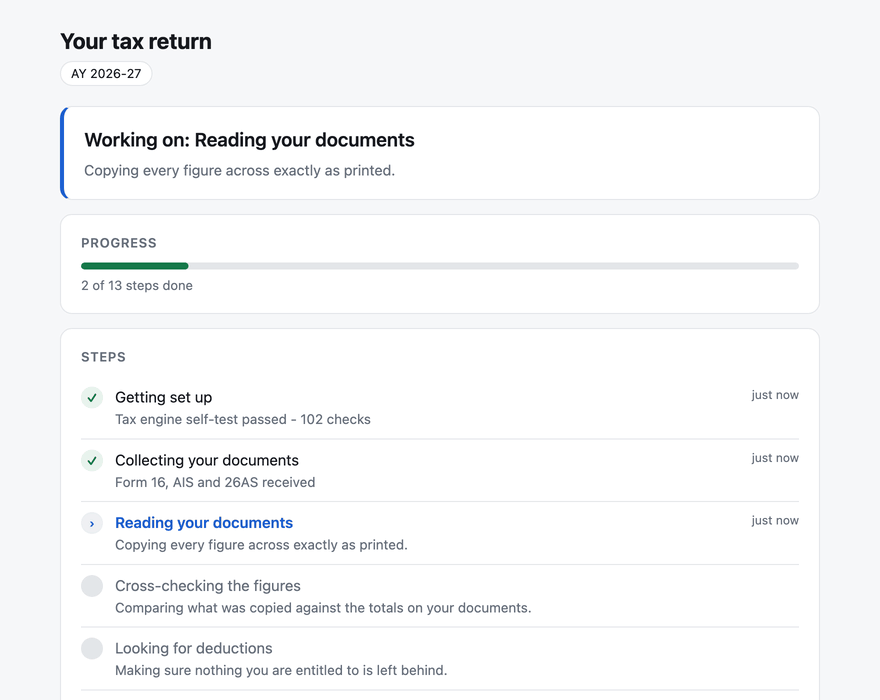

# ITR Wala AI Agent

**File your Indian income tax return from your terminal — with an AI agent that
actually drives the portal, and a tested Python engine that does every rupee of
the arithmetic.**

For **FY 2025-26 / AY 2026-27**. Resident individuals. Built for the returns that
are not simple: freelance income under s.44ADA, capital gains, and foreign assets
in Schedule FA.

```bash
git clone https://github.com/AIAnytime/itr-wala-ai-agent.git
cd itr-wala-ai-agent && ./install.sh          # also: --codex, --gemini, --all
```

Then open your agent and say **"file my ITR"**.



*The status page, so the person whose return it is never has to read a terminal:
a TDS mismatch stops the run and says why in one sentence, the refund lands once
both regimes are computed, and the amber card hands the final steps back — the
three only you can do.*

---

## Why this one

Most AI tax demos have the same two holes.

**The model does the arithmetic.** LLMs read a Form 16 beautifully and apply
s.87A marginal relief badly. One transposed digit in a token stream and your free
filing becomes a notice from CPC. Here the model never adds two numbers: it
extracts, interviews and explains, and `tax_core.py` — 41 golden tests, zero
dependencies, no network — computes.

**They stop at the portal door.** Producing a beautiful filing checklist and then
saying "now go type this into eportal.incometax.gov.in for forty minutes" leaves
the error-prone part exactly where it was. This agent opens the portal, reads
what the department already knows about you, and **compares its own computation
against the portal's, to the rupee**, before you submit.

The last mile is where returns go wrong. That is the mile this covers.

## What the agent will not do

Hard boundaries, not settings. There is no flag that relaxes any of them.

- **It never touches your credentials.** No `.env`, no password argument, no code
  path that types into a password field. You log in.
- **It never bypasses an OTP or a CAPTCHA.** It hands the browser back.
- **It never pays, submits, or e-verifies.** Those three acts bind you legally,
  so you perform them. The agent prepares everything and tells you exactly what
  to click and what figure to expect.
- **It never overwrites prefilled portal data silently.** A disagreement is a
  finding to resolve, not a field to fix.
- **It never guesses a number.** Missing figure, ambiguous document, out-of-scope
  situation — it stops and asks.

## How it works

```

```

| Script | Job |
|---|---|
| `tax_core.py` | Both regimes, all special rates, surcharge with marginal relief, 234A/B/C, 234F, s.288A/288B rounding |
| `check_return.py` | Closed-whitelist schema + cross-checks against your Form 16 / 26AS / AIS totals |
| `filing_pack.py` | Schedule-by-schedule portal field map, with no PAN in it |
| `portal_agent.py` | Supervised Playwright session; read-only by default |
| `progress.py` · `status_server.py` | A plain-English status page on `127.0.0.1`, for whoever the return belongs to |
| `test_*.py` | 102 tests. Run them before you trust the output. |

## For the person whose return it is

Filing takes hours, and from the outside most of it looks like nothing
happening. So there is a status page — not a dashboard with charts, just an
honest answer to three questions: **what stage are we at, is it waiting on me,
and what is the number.**

```bash
python3 skills/itr-agent/scripts/status_server.py --workspace itr-workspace
# -> http://127.0.0.1:7391
```

Thirteen steps in plain English ("Cross-checking the figures", not
`validate_income`), a progress bar, and the refund or payable figure as soon as
it exists. When the agent needs something, the page turns amber, says what it
needs, and offers an **I've done this** button. When something is wrong it turns
red, explains it in a sentence, and marks any figure on screen as not final.

It updates on its own — the scripts write to it when passed `--progress`, so
leaving the tab open is the whole interaction. That is the run in the GIF at the
top of this page.

**It binds to `127.0.0.1` and nothing else.** The page shows your salary and your
refund; it is not something to put on a network, and there is no flag to make it
listen elsewhere. No CDN, no fonts, no analytics — one file with its CSS and JS
inline, so it works with the machine offline. A test asserts the page contains
no outbound URL at all.

Nothing depends on it. If it is not running, the filing is identical.

## The parts other tools decline

Most open-source ITR tooling stops at salaried ITR-1 and ITR-2. The returns that
actually need help are the ones with a complication:

- **s.44ADA presumptive** — the 50% floor, the 75-lakh ceiling and how a 5% cash
  share cuts it to 50 lakh, the single 15-March advance-tax installment, and the
  "no account case" balance sheet the portal demands anyway.
- **Schedule FA** — the calendar-year reporting period, peak versus closing
  value, and the ₹10,00,000 Black Money Act penalty that applies **regardless of
  the asset's value** and regardless of whether it earned anything.
- **ITR-3 with presumptive income** — one overseas brokerage account rules out
  ITR-4 and forces ITR-3. You do **not** lose the 50% presumption by moving: it
  is declared in ITR-3's Schedule BP exactly the same way. People give that up
  every year over the misunderstanding.

Each has its own reference doc under `skills/itr-agent/references/`.

## Correctness

The engine is where the money is, so it is the part under test:

```bash
python3 skills/itr-agent/scripts/test_tax_core.py      # 41 tests
python3 skills/itr-agent/scripts/test_check_return.py  # 35 tests
python3 skills/itr-agent/scripts/test_progress.py      # 26 tests
```

Cases are written from the statute, not from the implementation — each asserts
what the section says, so a plausible-looking refactor that breaks the law fails.
A sample of what is pinned:

- 12,75,000 gross salary → **nil tax** in the new regime (75,000 standard
  deduction + the 12,00,000 s.87A threshold)
- s.87A marginal relief at slab income 12,10,000 → **10,400**, not 63,960
- The new-regime rebate threshold tests **slab income only** — a 112A gain
  neither consumes it nor benefits from it (Finance Act 2025)
- The old-regime rebate is a **cliff**: total income 5,00,010 loses all 12,500
- s.112A(6) bars the rebate against 112A tax in **both** regimes
- Chapter VI-A cannot shelter capital gains, VDA or winnings
- Surcharge marginal relief at every threshold; the new regime caps at 25%
- Rule 119A floors the 234A/B/C base to a hundred before applying 1%
- s.207(2): a resident 60+ with no business income owes no 234B or 234C
- s.115BAC(6): a belated return with no business income is **locked to the new
  regime**, and the engine overrides its own recommendation to say so

Plus invariants over a spread of inputs: tax is never negative, never falls as
income rises, and payable and refund are never both positive.

## Requirements

Python 3.10+ and nothing else for the tax engine — standard library only, no
network access, no telemetry.

The portal agent additionally needs Playwright:

```bash
pip install playwright && playwright install chromium
```

## Install

`install.sh` **never touches the network.** It copies files from the checkout you
just read. That matters for a tool that handles your salary and bank data: clone
it, read the diff, install the bytes you read.

```bash
./install.sh                # Claude Code, user scope (~/.claude/skills/)
./install.sh --here         # scope it to the current directory only
./install.sh --codex        # ~/.codex/skills/
./install.sh --gemini       # ~/.gemini/extensions/
./install.sh --all
```

Or as a Claude Code plugin:

```
/plugin marketplace add AIAnytime/itr-wala-ai-agent
/plugin install itr-wala-ai-agent@itr-wala-ai-agent
```

Scoping it to your tax folder with `--here` is the better default if you would
rather the skill not load in every unrelated session.

## Privacy

- The Python scripts have **no network access** and no telemetry. They read a
  local JSON file and print.
- Documents you hand the *agent* are read by an AI model, which means they leave
  your machine. The agent says so before it reads anything.
- **PAN, Aadhaar and account numbers are needed by the portal, never by the
  computation.** `check_return.py` errors if a PAN pattern appears in
  `return.json`, and the filing pack carries none. Type them into the portal
  yourself.
- The generated workspace ships a `.gitignore` that blocks tax documents,
  screenshots and `.env` before the first document arrives.

## Scope

**Covered:** resident individuals · salary · house property · s.44AD/44ADA
presumptive · capital gains including 111A/112A/112 and crypto · other sources ·
Chapter VI-A · Schedule FA disclosure · both regimes · interest and fees.

**Not covered, and the agent says so rather than approximating:** non-resident
and RNOR · F&O and intraday · s.44AB audit cases · foreign tax credit (Form 67 /
DTAA) · brought-forward losses (Schedule CFL) · the s.112 indexation cap on
pre-23-Jul-2024 property · ESOP perquisite deferral · agricultural income above
5,000 · any assessment year other than 2026-27.

## Credits

The idea of packaging Indian ITR filing as an agent skill with a deterministic
tax engine behind it comes from [karanb192/itr-wala](https://github.com/karanb192/itr-wala)
(MIT), which is worth reading. This is an independent implementation with a
different thesis — it drives the portal rather than stopping at it, and it covers
ITR-3, presumptive income and Schedule FA. All code here is written from scratch;
what is shared is the tax law, which belongs to nobody.

## Disclaimer

Not a chartered accountant, and not professional tax advice. Every figure is
computed by tested, deterministic code and every step is shown for review — but
you are the one filing, and the return is your responsibility. For anything
flagged out of scope, or if your situation feels unusual, get a CA to review the
generated filing pack. It is built to be handed over.

## License

MIT — see [LICENSE](LICENSE).
